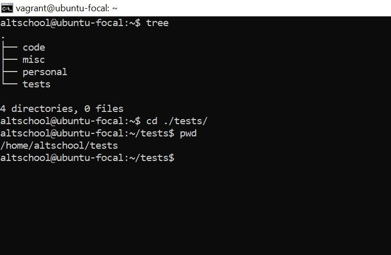
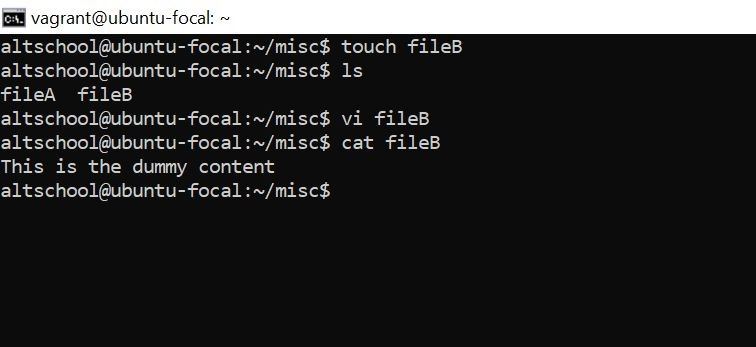
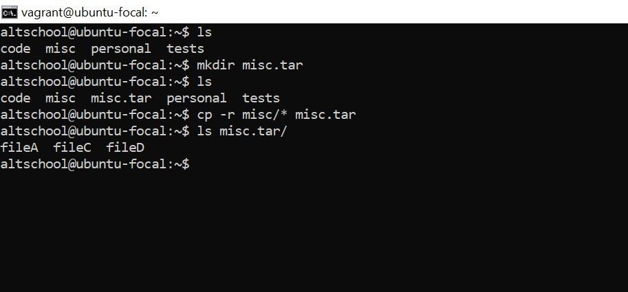
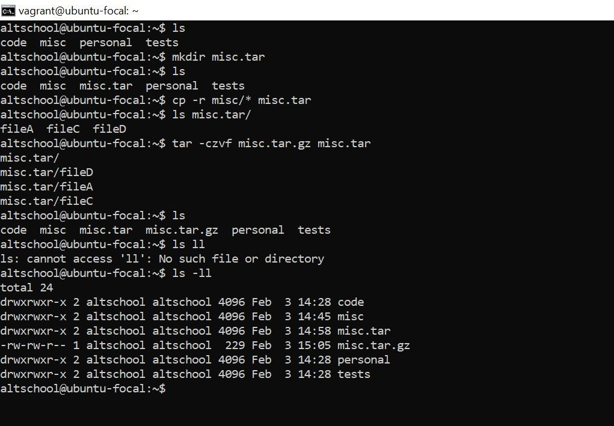
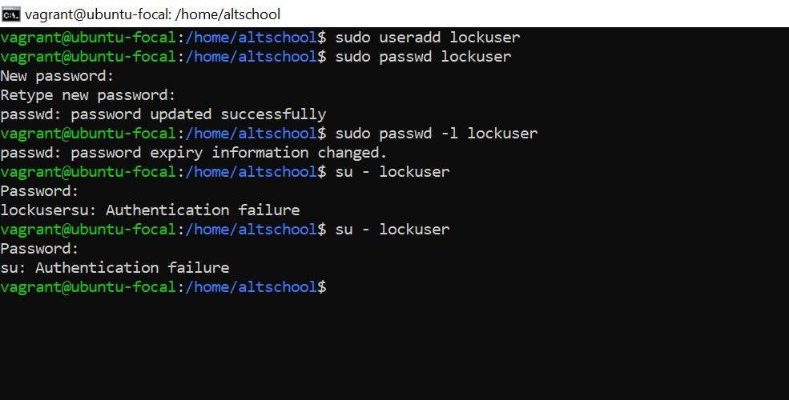
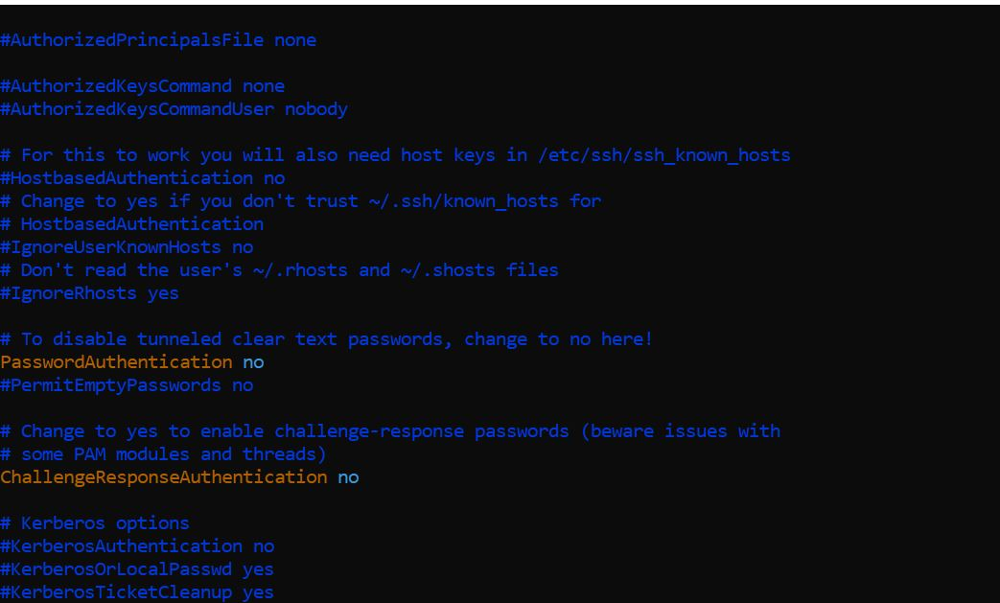

<h1>Some Basic Linux Commands<h1>

<ul> 
  <li>
Changing directory with absolute path name 

</li>  

<li>
Changing directory with relative path name 

</li>  

<li>
creating file with echo

</li>  

<li>
creating file in the misc directory

</li>  

<li>
copy command

</li>  

<li>
mv command

</li>  

<li>
creating a tar archive

</li>  

<li>
compressing the tar archive

</li>  

<li>
creating a user with force password change

</li>  

<li>
locking a user password

</li>     

<li>
creating a user with no login shell

</li>   

<li>
disabling password-based authentication

</li>   

<li>
disabling root login for ssh

</li> 

</ul>

